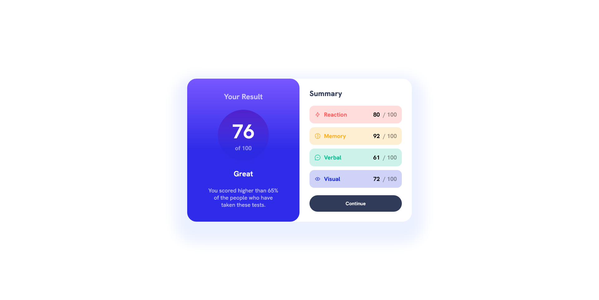

# Frontend Mentor - Results summary component solution

This is a solution to the [Results summary component challenge on Frontend Mentor](https://www.frontendmentor.io/challenges/results-summary-component-CE_K6s0maV). Frontend Mentor challenges help you improve your coding skills by building realistic projects. 

## Table of contents

  - [Screenshot](#screenshot)
  - [Links](#links)
  - [Built with](#built-with)
- [Author](#author)

### Screenshot

### Links

- Solution URL: [https://github.com/calebsg225/FM-results-summary-component](https://github.com/calebsg225/FM-results-summary-component)
- Live Site URL: [https://calebsg225.github.io/FM-results-summary-component/](https://calebsg225.github.io/FM-results-summary-component/)

## My process

I just started learning sass so I used that alot

### Built with

- Semantic HTML5 markup
- Sass
- Flexbox
- CSS Grid
- [React](https://reactjs.org/) - JS library

## Author

- Frontend Mentor - [@yourusername](https://www.frontendmentor.io/profile/calebsg225)